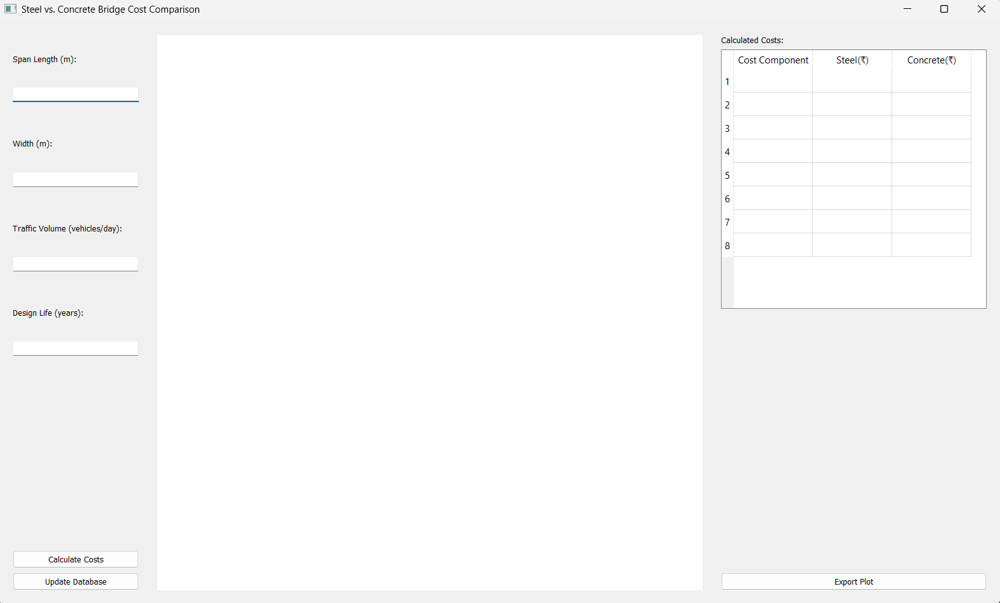

# Steel-vs.-Concrete-Bridge-Cost-Comparison-with-SQLite

## Overview
The **Bridge Cost Comparison Application** is a Python-based tool that allows users to compare the costs of steel and concrete bridges based on multiple cost components. It provides an interactive **GUI using PyQt5**, retrieves data from an **SQLite database**, and visualizes cost comparisons using **Matplotlib**.

## Features
- **Graphical User Interface (GUI):** User-friendly interface to input parameters and view results.
- **Cost Calculations:** Computes construction, maintenance, repair, demolition, environmental, social, and user costs.
- **Database Integration:** Retrieves cost rates from an SQLite database (`bridge_costs.db`).
- **Visualization:** Generates comparative bar charts for steel and concrete bridge costs.
- **Export Functionality:** Allows users to save cost comparison plots as PNG files.
- **Database Update:** Provides an interface for updating cost rates dynamically.

## Project Structure
The application is organized into multiple Python modules for better maintainability and readability:

```
bridge_cost_comparison/
│── gui.py            # Manages the PyQt5 GUI
│── calculations.py    # Handles all cost calculations
│── plot.py           # Generates visual cost comparisons using Matplotlib
│── main.py           # Entry point for the application
│── database.py       # Manages database interactions
│── bridge_costs.db   # SQLite database containing cost rates
│── README.md         # Project documentation
```

## Installation
### **Prerequisites**
Ensure you have Python installed (version 3.7 or higher).

### **Required Dependencies**
Install the required Python libraries using:
```sh
pip install PyQt5 matplotlib sqlite3
```

## Usage
### **Running the Application**
1. Navigate to the project directory.
2. Run the application using the command:
   ```sh
   python main.py
   ```
3. Click **"Update Database"** to modify cost rates.
4. Enter bridge parameters (Span Length, Width, Traffic Volume, Design Life).
5. Click **"Calculate Costs"** to compute and visualize cost comparisons.
6. Click **"Export Plot"** to save the cost comparison graph. 

## Screenshots


## Future Enhancements
- Implement **more bridge types** for comparison.
- Introduce **real-time database updates** via web integration.
- Provide **cost trend analysis** over time.


---

### **Author:** Souhridya Patra
For queries, contact: [GMail](mailto:souhridyapatra.2005@gmail.com)

